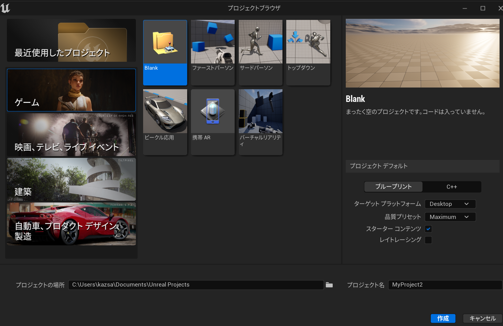
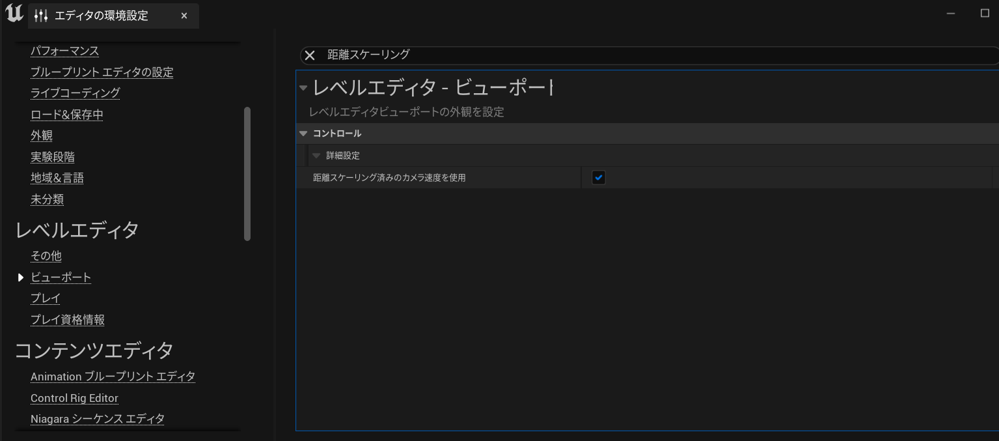

# インストール
## 対応Unrealバージョンのインストール
- PLATEAU SDK for UnrealはUE5での動作を想定しています。  
  UE5がインストールされていない場合は、以下URLからインストールしてください。
  - [Epic Games Launcher をこちらからインストールします。](https://www.unrealengine.com/ja/download)。
- Visual Studio 2019または2022
  - [こちらの手順に従ってください。](https://docs.unrealengine.com/5.0/ja/setting-up-visual-studio-development-environment-for-cplusplus-projects-in-unreal-engine/)

## Unrealプロジェクトの作成
- 先ほどインストールしたバージョンを起動します。

- 適宜設定を行い`作成`を押します。

## PLATEAU SDK for Unrealの導入
 - [リリースページ](https://github.com/Project-PLATEAU/PLATEAU-SDK-for-Unreal/releases)から提供されているzipファイルをダウンロードします。
 - 作成したプロジェクトのフォルダに`Plugins`という名前のフォルダを作成し、先程ダウンロードしたSDKを解凍しコピーします。
 - `Plugins/PLATEAU-SDK-for-Unreal/PLATEAU-SDK-for-Unreal.uplugin`が存在することを確認します。
 - プロジェクトを開きます。既にプロジェクトを開いている場合は一度閉じてから再度プロジェクトを開いてください。
 - プロジェクトを開く際に以下の画面が表示されるので`はい`を押して完了です。

# エディタ設定の変更(推奨)
## 自動再インポート対象の除外
1. `エディタの環境設定`から`ロード＆保存中`→`監査するディレクトリ`→`インデックス[0]`を選択します。
2. 除外対象として`PLATEAU/Datasets/*`を追加します。

この操作を行わない場合、取得されたgmlファイル等の生データを手動でインポート対象から除外する必要があります。

## 距離スケーリング済みのカメラ速度を使用
1. `エディタの環境設定`から`距離スケーリング`で検索します。
2. `距離スケーリング済みのカメラ速度を使用`にチェックを入れます。

この操作を行うことで広域なマップでの操作性が向上します。